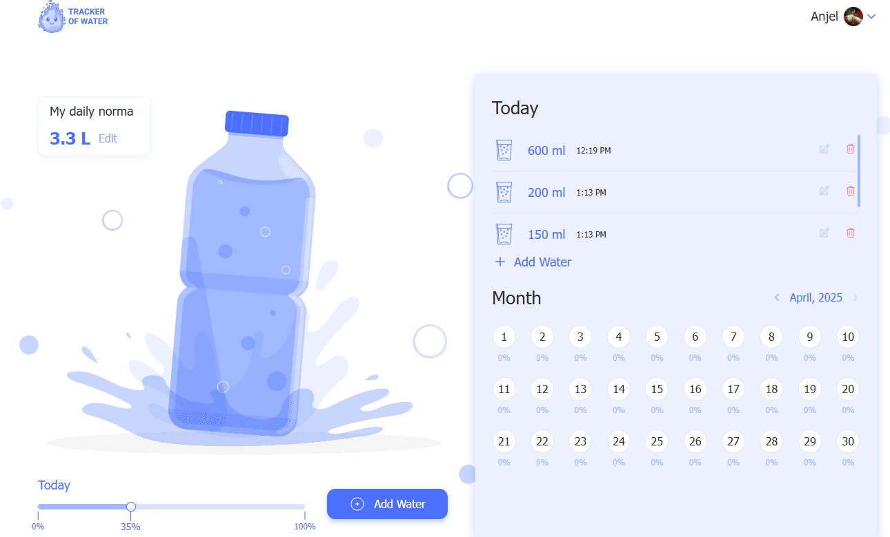

# Water Tracker App (Frontend) [Live demo](https://water-tracker-app-eight.vercel.app/)

This is the frontend for the Water Tracker application. Water Tracker a simple and intuitive fullstack app for tracking daily water intake.

## Installation

1.  Clone the repository:
    ```bash
    git clone <repository-url>
    ```
2.  Navigate to the project directory:
    ```bash
    cd water-tracker-app
    ```
3.  Install dependencies:
    ```bash
    npm install
    ```
    (or `yarn install` or `pnpm install` if you use those package managers)

## Available Scripts

In the project directory, you can run:

### `npm run dev`

Runs the app in development mode.\
Open [http://localhost:5173](http://localhost:5173) (or the port shown in your terminal) to view it in the browser.

The page will reload if you make edits.\
You will also see any lint errors in the console.

### `npm run build`

Builds the app for production to the `dist` folder.\
It correctly bundles React in production mode and optimizes the build for the best performance.

### `npm run lint`

Lints the project files using ESLint.

### `npm run preview`

Serves the production build locally for preview.
Open [http://localhost:4173](http://localhost:4173) (or the port shown in your terminal) to view it in the browser.

## Core Technologies

*   React
*   Redux Toolkit
*   TypeScript
*   Vite
*   Tailwind CSS

## About the Author

**Petro Zaitsev**  
_GitHub_: [grizeus](https://github.com/grizeus)  

As a dedicated front-end developer with a passion for innovation, I'm excited to connect with like-minded professionals in the tech industry. With expertise in **HTML5, CSS3/SASS, JavaScript/TypeScript, Tailwind, React**, and more, I bring digital projects to life through clean code and thoughtful design. When I'm not coding, I’m learning new technologies and collaborating with driven teams to deliver high-quality results.

---

🚀 **Let’s build something great together!**